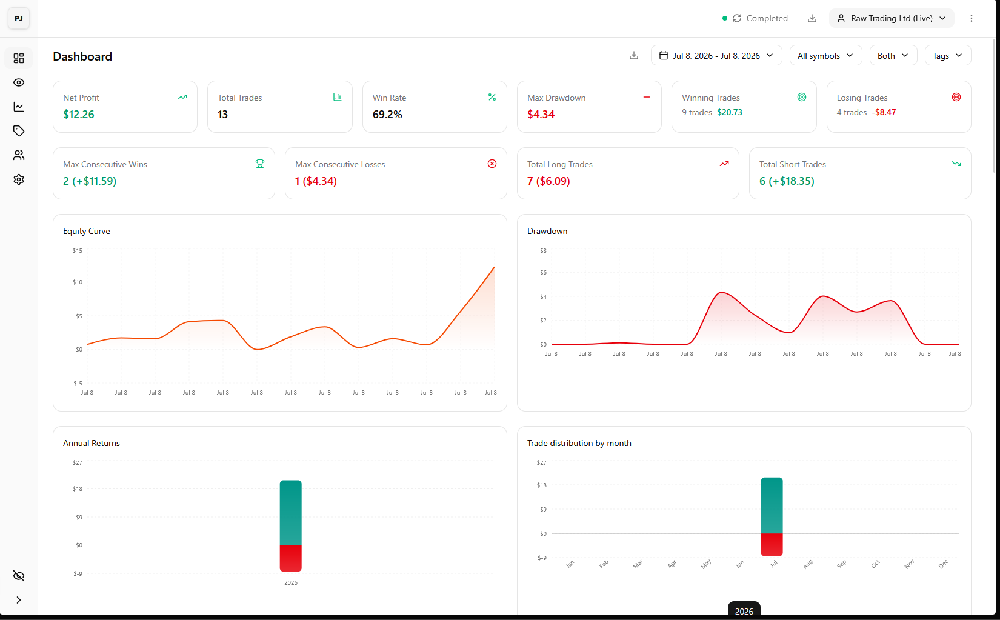
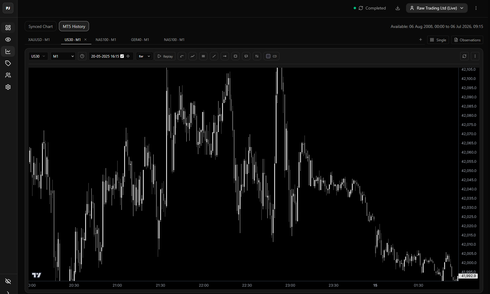

# Personal Journal — pipCircuit

A **next-generation trading journal and analytics platform** for forex, CFD, and indices traders. Fully offline-capable Progressive Web App (PWA) with cloud sync, built with Next.js and Clean Architecture.




---

## Overview

pipCircuit helps serious retail traders track, analyze, and improve their trading by combining automated trade import, professional-grade charting, rich journaling, and cross-device synchronization.

### Key Features

- **Automated Trade Import** — Import trade history from MetaTrader 5 (MT5) and cTrader brokers with full order details.
- **Professional Charting** — Interactive candlestick charts powered by TradingView Lightweight Charts with drawing tools (trendlines, rectangles, paths, Gann levels, long/short position annotations), risk/reward overlays, MAE, multi-timeframe support, and replay mode.
- **Rich Trade Journaling** — Annotate each trade with rich-text entries, tags, ratings, mindset indicators, and screenshots using TipTap editor.
- **Performance Analytics** — Equity curves, drawdown analysis, win rate, Sharpe ratio, session analysis, per-asset performance, risk metrics, and trade distribution charts (Recharts).
- **Live Position Management** — Connect to cTrader for real-time position monitoring, drag-and-drop SL/TP on chart, price alerts, and quick order entry from the crosshair.
- **Market Observations** — Dedicated observation system for noting market conditions with categorized entries and calendar-based daily journaling.
- **Offline-First & Cross-Device Sync** — Local IndexedDB (Dexie) as primary data store with Supabase cloud sync for seamless cross-device usage. Full sync orchestration with conflict resolution and progress tracking.
- **PWA Support** — Installable as a desktop/mobile app with service worker caching and offline access.

---

## Tech Stack

| Category | Technology |
|---|---|
| **Framework** | Next.js 16 (App Router), React 19 |
| **Language** | TypeScript 5 (strict) |
| **Charts** | TradingView Lightweight Charts 5 + custom line-tools plugins |
| **State** | Zustand 5 (UI), TanStack React Query 5 (server state) |
| **Database (Local)** | Dexie.js 4 (IndexedDB) |
| **Database (Cloud)** | Supabase (PostgreSQL) |
| **UI** | Tailwind CSS 4, shadcn/ui, lucide-react, Framer Motion 12 |
| **Rich Text** | TipTap 3 |
| **Validation** | Zod 4 |
| **Testing** | Vitest 4 |
| **Broker APIs** | cTrader (gRPC), MT5 (local service) |
| **Deployment** | Vercel |

---

## Architecture

The project follows **Clean Architecture** with strict dependency inversion:

```
┌──────────────────────────┐
│         UI Layer         │  React components, hooks, Zustand stores
├──────────────────────────┤
│    Application Layer     │  Use cases, DTOs, port interfaces
├──────────────────────────┤
│   Infrastructure Layer   │  Dexie/Supabase repos, cTrader/MT5 clients, sync engines
├──────────────────────────┤
│       Domain Layer       │  Entities, value objects, enums, domain services (zero deps)
└──────────────────────────┘
```

All dependencies point inward — the Domain layer has no external dependencies.

---

## Getting Started

```bash
# Install dependencies
bun install

# Run development server
bun dev

# Build for production
bun run build

# Run tests
bun test

# Lint
bun lint
```

Open [http://localhost:3000](http://localhost:3000) to view the app.

### Environment Variables

Copy `.env.example` to `.env.local` and configure:

- `NEXT_PUBLIC_SUPABASE_URL` — Supabase project URL
- `NEXT_PUBLIC_SUPABASE_ANON_KEY` — Supabase anonymous key
- `CTRADER_CLIENT_ID` — cTrader API client ID
- `CTRADER_CLIENT_SECRET` — cTrader API client secret

---

## Local Services

### MT5 History Service

Windows service that imports trade history from MetaTrader 5. See `local-services/mt5-history-service/README.md`.

### cTrader Live Service

WebSocket bridge for real-time cTrader data. See `local-services/ctrader-live-service/README.md`.

---

## Project Structure

```
src/
├── app/              Next.js App Router pages and API routes
├── application/      Use cases, DTOs, mappers, port interfaces
├── config/           Environment and app configuration
├── domain/           Entities, value objects, enums, domain errors
├── infrastructure/   DB repositories, API clients, sync services
├── lib/              Utility helpers
├── types/            Shared TypeScript types
└── ui/               React components, hooks, providers, Zustand stores
    ├── components/   Charts, layout, panels, forms, settings, sync
    ├── features/     Feature-scoped pages (auth, trade-detail, trade-list)
    ├── hooks/        Custom React hooks
    ├── providers/    React context providers
    └── state/        Zustand stores
```

---

## Testing

```bash
# Run all tests
bun test

# Run unit tests only
bun test tests/unit

# Run integration tests only
bun test tests/integration
```

---

## Deployment

The app is designed to be deployed on **Vercel** with Supabase as the backend.

```bash
vercel --prod
```

See `vercel.json` for configuration.

---

## License

Private project — all rights reserved.
